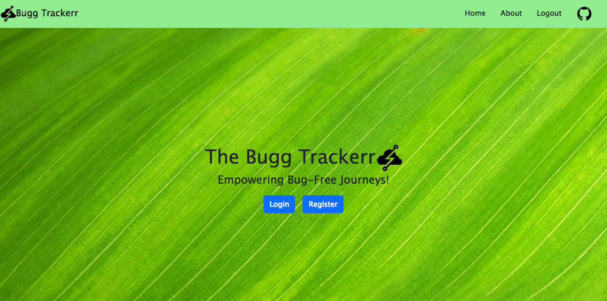
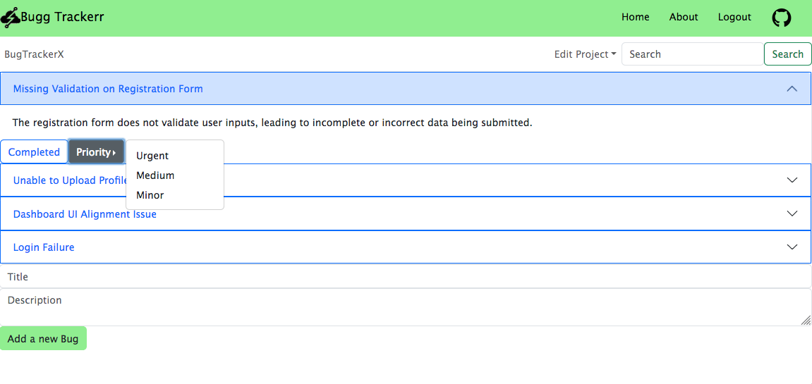

# Bug Tracker

Bug Tracker is a bug tracking system designed to help teams manage and prioritize software issues efficiently. It is coded with JavaScript, React, HTML, CSS, and integrates seamlessly with Firebase for secure user authentication and storage of login credentials.

## Features

- Create, update, and close bug reports
- Assign bugs to specific team members
- Categorize bugs by severity, status, and priority
- Search and filter functionality to find specific bugs
- Responsive and user-friendly interface





## Getting Started

These instructions will guide you through setting up and running Bug Tracker on your local machine for development and testing.

### Prerequisites

Ensure that you have the following software installed on your machine:

- [Node.js](https://nodejs.org/)
- [npm](https://www.npmjs.com/) (comes with Node.js)

### Installing

1. Clone the repository:

   ```bash
   git clone https://github.com/MSO03/bug-tracker.git
   ```

2. Navigate to the project directory:

   ```bash
   cd bug-tracker
   ```

3. Install dependencies:

   ```bash
   npm install
   ```

### Running the Bug Tracker

Start the Bug Tracker:

```bash
npm start
```

The application will be accessible at [http://localhost:3000](http://localhost:3000) in your web browser.

### Usage

1. Create a new account or log in if you already have one.
2. Explore the bug tracking features and functionalities.
3. Create new bugs, assign them, and update their status as needed.

## Contributing

Contributions are welcome! If you'd like to contribute to Bug Tracker, please follow these steps:

1. Fork the repository.
2. Create a new branch: `git checkout -b feature/new-feature`
3. Make your changes and commit them: `git commit -m 'Add new feature'`
4. Push to the branch: `git push origin feature/new-feature`
5. Submit a pull request.
